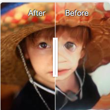

## Two-Stage Framework for Distortion Estimation and Image Restoration in Underwater Imaging 

Paper | [Project Page](https://jermainn.github.io/Project-Pages/DR-Net/) 

<!--  -->

[Jianming Liu](https://github.com/jermainn)<sup>1,2,3</sup>, Congzheng Wang<sup>1,2,3,\*</sup>, Chuncheng Feng<sup>1,2</sup>, Lei Liu<sup>1,2</sup>, Wanqi Gong<sup>1,2</sup>, Zhibo Chen<sup>1,2</sup>, Libin Liao<sup>1,2,3</sup>, Chang Feng<sup>1,2,3,\*</sup>

<sup>1</sup>National Key Laboratory of Optical Field Manipulation Science and Technology, Chinese Academy of Sciences<br>
<sup>2</sup>Institute of Optics and Electronics, Chinese Academy of Sciences<br>
<sup>3</sup>University of Chinese Academy of Sciences<br>

<!-- <p align="center">
    
</p> -->


The project is **comming**. Thanks for your patience. :hugs:

<!-- ### Visual Results -->

[](https://jermainn.github.io/Project-Pages/DR-Net) [](https://jermainn.github.io/Project-Pages/DR-Net) [](https://jermainn.github.io/Project-Pages/DR-Net) 

  


### Contents

- [Installation](#Installation)
- [Training](#Training) 
- [Testing](#Testing) 
- [Results](#Results) 
- [Citation](#Citation) 


### Installation

**clone this repo**

```bash
git clone https://github.com/jermainn/Project-DR-Net.git
cd Project-DR-Net
```

**create an environment** 

```bash
conda create -n drnet python=3.8
conda activate drnet
pip install -r requirements.txt
```


### Training

You should modify the `train_options.py` file from [options](/options) first 

#### Downloads

- The underwater distortion image can be downloaded from [Datasets](https://cseweb.ucsd.edu/~viscomp/projects/WACV18Water/) based on ImageNet dataset, also you can download the set from our [Baidu Netdisk](https://pan.baidu.com/s/1-u4jo6IeB1f2j0kJS2CZ_w?pwd=by34) or [Google Drive](https://drive.google.com/drive/folders/15G36ZsbY9Xfah84Ga4VilAr7zJqIkf8X?usp=sharing). The origional ImageNet set is from [ImageNet](http://www.image-net.org/).

- TianDataset can be obtained in [SeeingThroughWater](https://www.cs.cmu.edu/~ILIM/projects/IM/water/research_water.html).
- Other Datasets: [Baidu Netdisk](https://pan.baidu.com/s/1JjPVHtpNRGg7Jpo9Y2EA9A?pwd=9rhe) | [Google Drive](https://drive.google.com/drive/folders/1TZg_GbTenDaRi3bjLIidWnaWA7XZ3nKf?usp=sharing) .


**Train the network**

```bash
python train.py --is_train  --dataroot ./data  --batch_size 8  --snapshot_dir ./experiments  --max_epochs 20
```

**Train DE-Net only** 

```bash
python train.py --is_train  --dataroot ./data  --batch_size 8  --snapshot_dir ./experiments  --ir_gan  --max_epochs 10
```

**Train IR-GAN only** 

```bash
python train.py --is_train  --dataroot ./data  --batch_size 8  --snapshot_dir ./experiments  --freeze_de_net  --max_epochs 10
```


### Testing

You can modify the `test_options.py` file from [options](/options) 

Run `evaluate.py` file for distorted underwater image restoration [Datasets](https://cseweb.ucsd.edu/~viscomp/projects/WACV18Water/) or [Baidu Netdisk](https://pan.baidu.com/s/1Wn_Ark_ycpoD8MFuhPuvwg?pwd=jcyc) | [Google Drive](https://drive.google.com/drive/folders/15G36ZsbY9Xfah84Ga4VilAr7zJqIkf8X?usp=drive_link) . The trained model can be found in [Model](https://drive.google.com/file/d/1uQWhH7vxm1NETOhx8ckIxb197YQFDNMd/view?usp=sharing) .

```bash
python evaluate.py --dataroot ./data  --batch_size 8  --snapshot_dir ./experiments  --restore_from /pretrained_model/model.pth
```

then you can fine-tune the model by applying it to other datasets and reconstruct underwater degraded image


### Results

<details>
<summary>comparisons on LiSet for underwater distorted image restoration</summary>
<p align="center">
  
</p>
</details>


<details>
<summary>comparison with the state-of-the-arts on synthetic and real captured datasets</summary>
<p align="center">
  
</p>
</details>


### Citation

Please cite us if our work is useful for your research.

```
@article{
}
```


